# 如何安装 Garlic OS (Windows)

以下内容以 Windows 11 为例介绍如何安装 Garlic OS 。

## 准备工作

### 硬件

- 安装了 Windows 的电脑
- TF 卡 1 至 2 张
  - 如果经常折腾系统，建议使用两张卡，TF1 仅存放系统，用一张 4 GB 的就够了 (目前能买到的最小的 TF 卡似乎是 16 GB 的)；TF2 存放 ROMS ，能放下所有要玩的游戏就行。
  - 如果懒得折腾系统，那么只用一张 TF 卡也是可行的。
- 如果电脑没有带读卡器功能的话，要准备一个 TF 卡的读卡器

### 软件

- [7-zip](http://7-zip.org/) 用于解压 Garlic OS 发布的 `.7z` 格式的压缩文件, 轻巧的解压缩软件，建议安装。
- [balenaEtcher](https://www.balena.io/etcher/), 用于将 `.img` 文件写入 TF 卡。如本文使用的是 `balenaEtcher-Portable-1.13.1.exe` 不需要安装。
- [DiskGenius 中国版](https://www.diskgenius.cn/), 用于调整 ROMS 分区大小。如本文使用的是 `DG5461441_x64.zip` ，不需要安装，解压即可使用。
  - 如果使用两张 TF 卡，就不需要使用该软件。
  - ROMS 分区默认是 3.16 GiB ，如果空间够用的话，也可以不用该软件。
  - 使用中国版的原因是，中国版不用安装就可以用。
- [guiformat.exe](http://ridgecrop.co.uk/index.htm?guiformat.htm) 用于格式化大于 32 GiB 的 ROMS 分区。注意在该页面中点击软件截图就可以下载，没有独立的下载按钮或链接。
  - 注意: 仅当存放 ROMS 的分区超过 32 GiB，才需要该工具。
  - 注意: 这不是一个无损调整的工具。

### Garlic OS

## 安装 Garlic OS

### 1. 准备镜像文件

1. 将 `RG35XX-Garlic-MicroSDCardImage.7z` 解压，得到 `garlic.img`

### 2. 烧录 TF 卡

1. 打开 balenaEtcher , 选择 "从文件烧录", 选择刚刚解压出来的 `garlic.img` 文件

  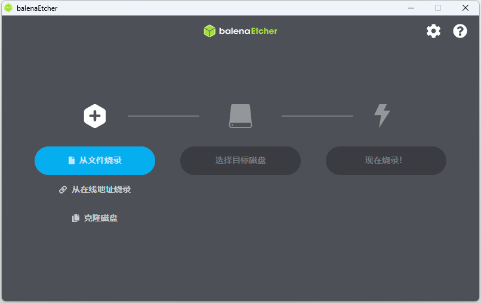

2. 把 TF 卡插入读卡器, 或插入电脑。
3. 在 balenaEtcher 中点击 "选择目标磁盘" , 选择要安装 Garlic OS 的 TF 卡 (注意别选错了!)

  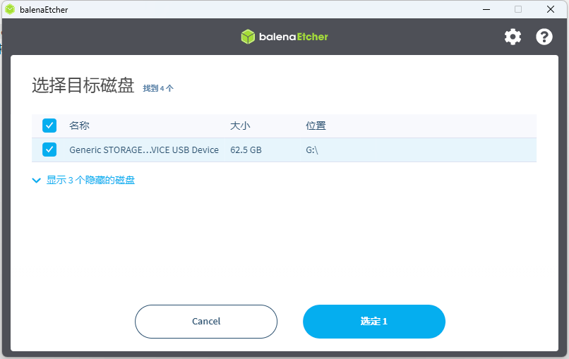

4. 在 balenaEtcher 中确认好信息之后，点击 "现在烧录!"。在这一过程中会触发 UAC 提示，确认即可。

  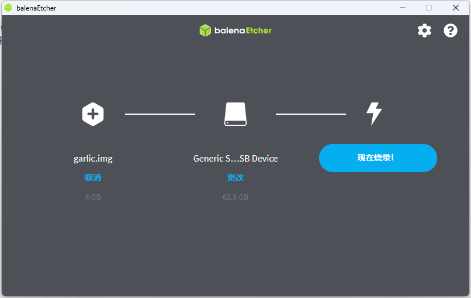

5. 耐心等待 balenaEtcher 烧录完成。

  注: 在烧录过程中显示的广告可能会有所不同，这不影响烧录的结果。

  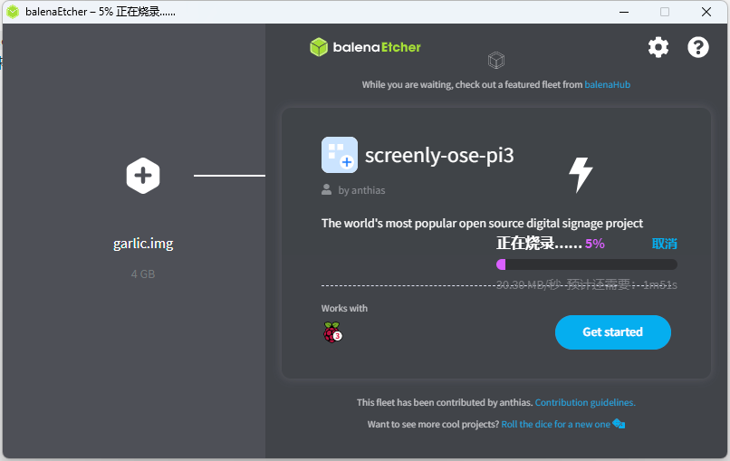

  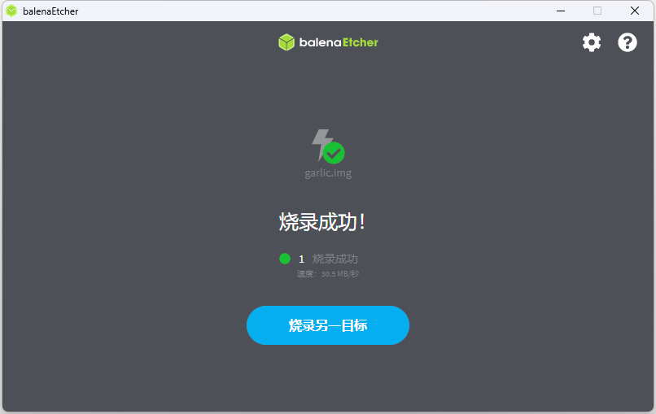

  注: 烧录完成后，Windows 可能会提示 XX 分区需要格式化。请务必忽略这些提示。
  注: 如果烧录失败，可以重来一次。

  烧录成功之后就可以关闭 balenaEtcher 了。

6. 如果要使用两张 TF 卡，请将 ROMS 分区中的 `ROMS` 文件夹先复制到本地硬盘，以供后续使用。

### 3. 扩大 ROMS 分区

`garlic.img` 烧录出来的磁盘是 4 GB 的，其中 ROMS 分区只有 3.2 GB 。如果需要用这张卡上的 ROMS 分区，那么就可以使用 DiskGenus 工具将其扩大。例如在这里使用的是一张 64 GB 的 TF 卡。

1. 打开 DiskGenius, 可以看到新烧录的 SD 卡中的分区信息如下所示:

  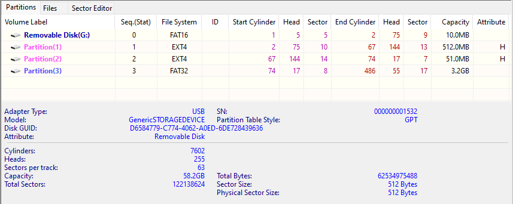

2. 在 DiskGenius 中，选中 FAT32 分区，在右键菜单中点击 "Resize Partition"

  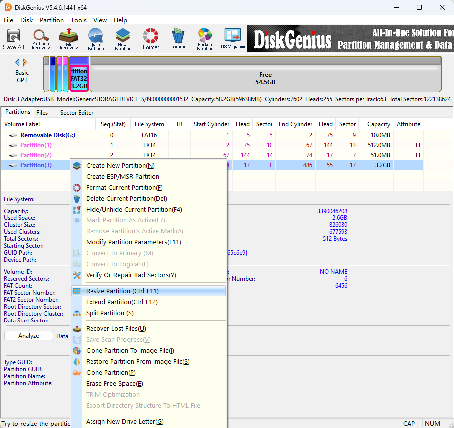

3. 在 "Resize Partition" 窗口中，将蓝色分区右边拖动到最后，或者手动输入 `Space of Rear Part` 的值为 `0` ，使分区占据所有剩余的空间。

  调整前: 这个分区只有 3.16 GB

  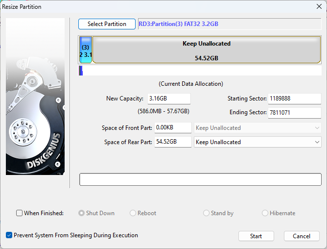

  调整后: 分区大小变为 57.67 GB

  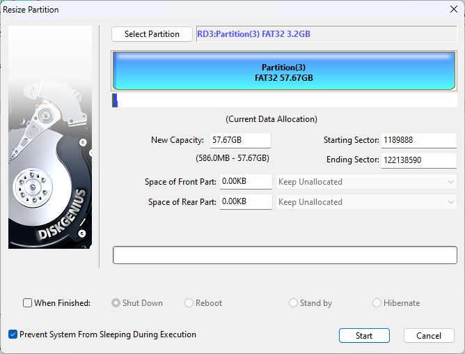

4. 确认无误后，点击 "Start"，并确认。

  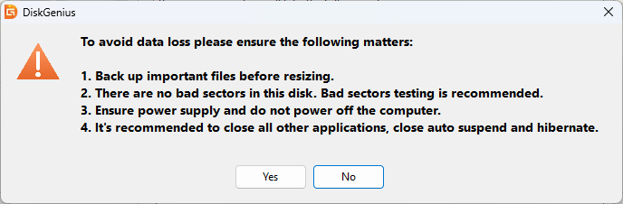

  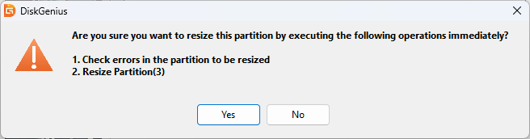

### 4. 准备 ROMS SD 卡

注: 这一节描述的内容仅适用于新卡。如果你已经准备好了 ROMS ，那么就不需要按此节进行操作。

1. 将需要操作的 TF2 卡插入电脑
2. 以管理员身份打开 FAT32 Format 程序，选中正确的 TF 卡后，将 `Volume label` 设置为 `ROMS`，选择 "Start" 并确认。

  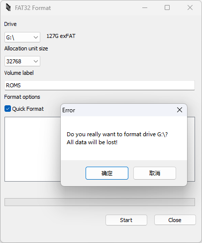

  注: 在这一步中如果反复出现文件被占用的提示，可以先用 Windows 把 TF2 格式化一遍，格式化成 NTFS 或者 exFAT 都无所谓。

3. 格式化完成

  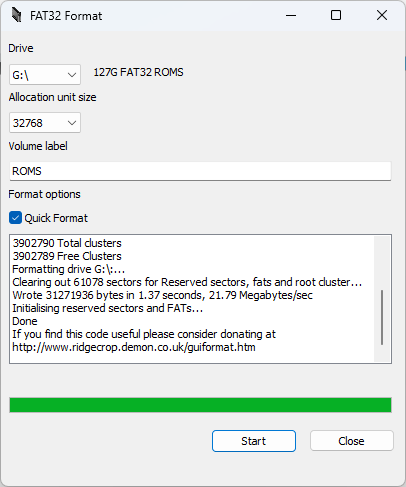

4. 把之前备份出来的 Roms 中的全部文件夹复制进 TF2 的根目录中。

  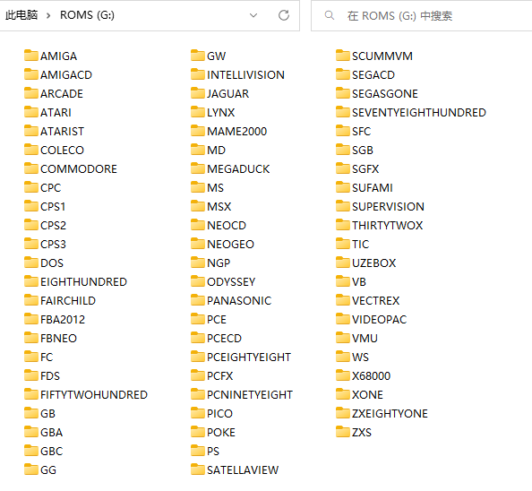

## 升级 Garlic OS

升级 Garlic OS 的过程如下:

1. 下载新的 Garlic OS 文件，这里只需要使用 `RG35XX-Garlic-CopyPasteOnTopOfStock.7z` 即可
2. 解压该文件，得到 `misc`, `ROMS` 两个目录和 `README.txt` 文件。

  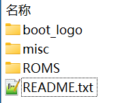

  为了避免混淆，下面将这几个文件夹称为 **升级文件** 。

3. 将 TF1 插入电脑，把需要备份的信息备份好

  - 最有价值的应该是存档
  - 其次应该是一些配置文件

4. 打开 TF1 的 `misc` 分区，将 **升级文件** 中的 `misc` 文件夹中的同名文件复制进去，覆盖同名文件
5. 打开 TF1 的 `ROMS` 分区，将 **升级文件** 中的 `ROMS` 文件夹中的 `BIOS`, `CFW` 和 `Roms` 复制进去，覆盖同名文件

  - `Roms` 下一般都是空文件夹，因此不会造成什么副作用。

6. 如果使用了 TF2 ，那么也要将 **升级文件** 中的 `ROMS` 文件夹中的 `Roms` 文件夹内的各个文件夹复制到 TF2 卡的对应位置。
