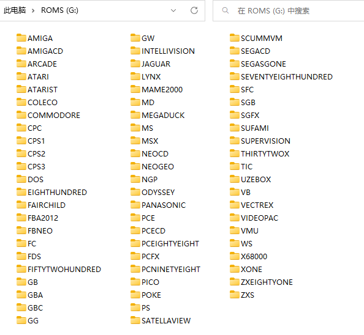

# 分区信息

## TF1


### misc 分区 (FAT16) 10.0 MiB

插卡后可以直接被 Windows 读取。用于从 `CopyPasteOnTopOfStock.7z` 升级系统文件。

### (EXT4) 主分区 512.0 MiB

看上去是挂载到了 `/` 。

```
+---appres
|   +---bin
|   +---boot
|   +---desktop_res
|   +---game_menu
|   +---setjoy
|   +---setkey
|   +---shutdown
|   +---sound
|   +---test
|   +---theme
|   \---wallpapers
+---bin
+---dmenu
+---etc
+---lib
+---lost+found
\---usr
    +---cards
    +---lib
    +---local
    |   +---lib
    +---pcm
    +---sbin
    \---share
```

### (EXT4)

看上去是空的，可能是挂载到了 `/swap` , 暂无法确定。

### ROMS 分区 (FAT32)

插卡后可以直接被 Windows 读取。用于备份、存放缩略图、获取日志等。如果仅使用一张 SD 卡，那么 ROMS 也存放在这个分区中。

```
+---BIOS
+---CFW
|   +---skin
|   |   +---system
|   |   \---games
|   +---config
|   \---retroarch
|       |   retroarch
|       \---.retroarch
|           +---downloads
|           |   \---core_backups
|           |       \---mgba_libretro
|           +---config
|           +---autoconfig
|           +---filters
|           |   +---video
|           |   \---audio
|           +---assets
|           |   \---rgui
|           |       +---font
|           |       \---wallpaper
|           +---cores
|           +---core_info
|           +---overlay
|           +---shaders
|           +---screenshots
|           +---states
|           +---playlists
|           +---thumbnails
|           |   \---GBA
|           |       +---Named_Boxarts
|           |       +---Named_Snaps
|           |       \---Named_titles
|           +---database
|           |   +---rdb
|           |   \---cursors
|           +---cheats
|           +---records_config
|           +---records
|           +---logs
|           |       retroarch.log
|           +---saves
|           \---system
\---Roms
    +---AMIGA
    +---ARCADE
    ...
```

## TF2

如果用了两张 TF 卡，那么 TF2 整个分区就用来存放所有的 ROMS 。


