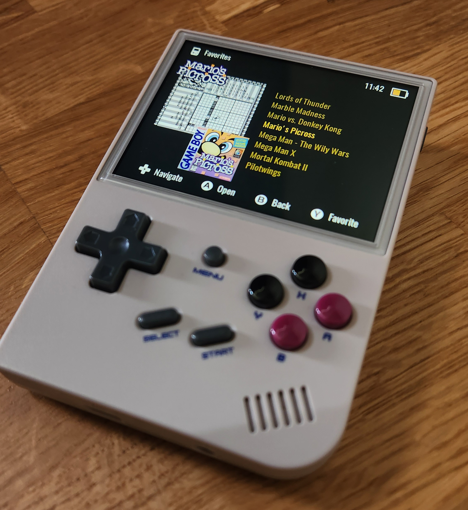
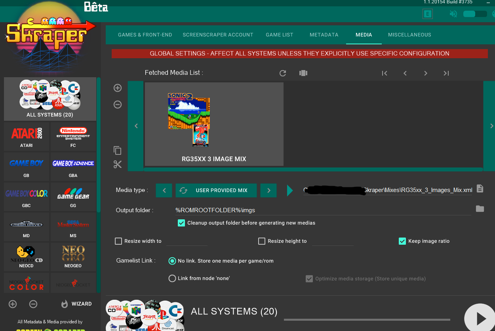
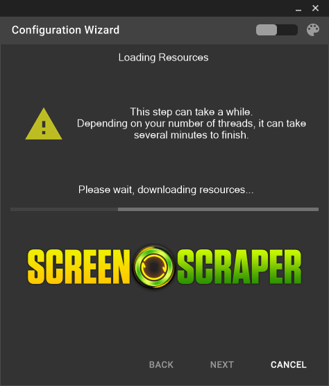

# 缩略图

在 RGUI 中支持 playlist 的缩略图。

## playlist

RetroArch 的 playlist 是以 `.lpl` 为后缀名的 JSON 文件。

## 缩略图

缩略图的根目录是 TF1 卡中的 `ROMS` 分区下的 `/CFW/retroarch/.retroarch/thumbnails/` 目录。应当存放在和 playlist 同名的目录下。

例如，有一个 playlist 名为 `Atari - 2600.lpl`，那么对应的缩略图应放在 `Atari - 26000` 目录下，如下所示：

```
/CFW/retroarch/.retroarch/thumbnails/
    Atari - 2600/
        Named_Boxarts/
            Q_bert's Qubes.png
        Named_Snaps/
            Q_bert's Qubes.png
        Named_Titles/
            Q_bert's Qubes.png
```

缩略图的文件名应和 playlist 中的 `label` 完全一致，但 `label` 中的 <code>$*/:\`<>?\|</code> 这几个字符应当被替换为 `_`。

## Game Arts

在 2023-01-12 的版本后开始支持, 在 2023-01-23 的版本中得到了改善。

将 640x480 的图片按 ROMS 的文件夹规则放置在: `/Roms/{主机名}/Imgs/` 下。

(注: 在 2023-01-24 的版本中修复了, 但仅支持放在 TF1 中)

例如:

```
TF1 中的 Roms 分区
    Roms/GBA/
        Imgs/
            Advance Wars (USA).png
            Kirby _ The Amazing Mirror (USA).png
        Advance Wars (USA).zip
        Kirby _ The Amazing Mirror (USA).gba
```

或：

```
TF1 中的 Roms 分区
    Roms/
        GBA/Imgs/
            Advance Wars (USA).png
            Kirby _ The Amazing Mirror (USA).png
TF2
    GBA/
        Advance Wars (USA).zip
        Kirby _ The Amazing Mirror (USA).gba
```

按该种方法可以在游戏列表中显示图片，但是直接使用满屏图片的效果并不特别如意，会和游戏名产生很大的干扰，如下图所示:


## 使用 Skraper

使用 [Skraper](https://www.skraper.net/) 可以批量抓取图片、按规则重命名并自动进行图像处理等，功能相当高级。在 Reddit 中有相当成功的案例，但需要详细调节。

在此参考 [来自 reddit 的帖子](https://www.reddit.com/r/RG35XX/comments/120p5k7/psa_mogrify_is_not_needed_for_positioning_box_art/) , 摘录如下:

### 效果

使用这一方案的最终结果如下图所示：




### Skraper 的操作流程

1. 在左侧点击 "All Systems"
2. 点击 "Media" 选项卡
3. 在 "Media Type" 中选择 "User Provided Mix"
4. 下载 [这个 xml](./assets/skraper_image_mix.xml)
5. 在 Skraper 中选择这个文件
6. 应该能看到如下所示的效果图 (请注意图片已经放置在靠左的位置了):

  

### 其他配置

在 TF1 的 `ROMS` 分区的 `/CFW/skin/settings.json` 文件中，做如下修改:

```
"text-alignment": "left",
"text-margin": 300
```

### 其他问题

在使用过程中，启动 Skraper 的过程相当慢，暂时还没有进一步的资料。



## 参考

- [RGUI Interface](https://docs.libretro.com/guides/rgui/)
- [Playlists and Thumbnails](https://docs.libretro.com/guides/roms-playlists-thumbnails/)
- [libretro-thumbnails @ GitHub](https://github.com/libretro-thumbnails/libretro-thumbnails)
