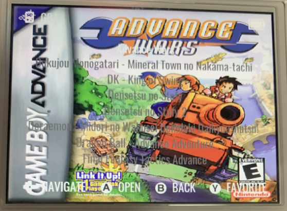

# 缩略图

在 RGUI 中支持 playlist 的缩略图。

## playlist

RetroArch 的 playlist 是以 `.lpl` 为后缀名的 JSON 文件。

## 缩略图

缩略图的根目录是 TF1 卡中的 `ROMS` 分区下的 `/CFW/retroarch/.retroarch/thumbnails/` 目录。应当存放在和 playlist 同名的目录下。

例如，有一个 playlist 名为 `Atari - 2600.lpl`，那么对应的缩略图应放在 `Atari - 26000` 目录下，如下所示：

```
/CFW/retroarch/.retroarch/thumbnails/
    Atari - 2600/
        Named_Boxarts/
            Q_bert's Qubes.png
        Named_Snaps/
            Q_bert's Qubes.png
        Named_Titles/
            Q_bert's Qubes.png
```

缩略图的文件名应和 playlist 中的 `label` 完全一致，但 `label` 中的 <code>$*/:\`<>?\|</code> 这几个字符应当被替换为 `_`。

## Game Arts

在 2023-01-12 的版本后开始支持, 在 2023-01-23 的版本中得到了改善。

将 640x480 的图片按 ROMS 的文件夹规则放置在: `/Roms/Imgs/` 下，需要再按模拟器做一层文件夹。

(注: 在 2023-01-24 的版本中仍有问题)

例如:

```
/Roms/Imgs/
    GBA/
        Advance Wars (USA).png
        Kirby _ The Amazing Mirror (USA).png
```

(下面是 2023-01-12 的版本中的路径)

via https://www.reddit.com/r/RG35XX/comments/10fyf1a/question_for_those_who_use_garlicos/

```
/CFW/skin/games/
    GBA/
        Advance Wars (USA).zip.png
        Kirby _ The Amazing Mirror (USA).zip.png
```

按该种方法可以在游戏列表中显示图片，但是直接使用满屏图片的效果并不特别如意，会和游戏名产生很大的干扰，如下图所示:



## 参考

- [RGUI Interface](https://docs.libretro.com/guides/rgui/)
- [Playlists and Thumbnails](https://docs.libretro.com/guides/roms-playlists-thumbnails/)
- [libretro-thumbnails @ GitHub](https://github.com/libretro-thumbnails/libretro-thumbnails)